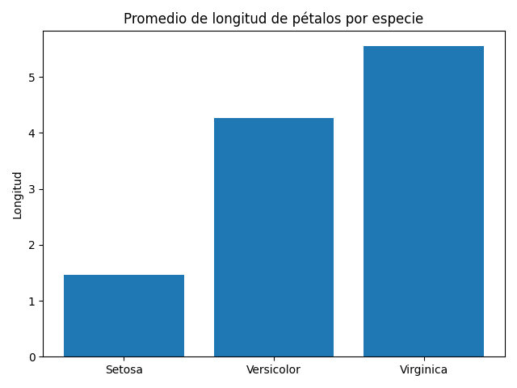
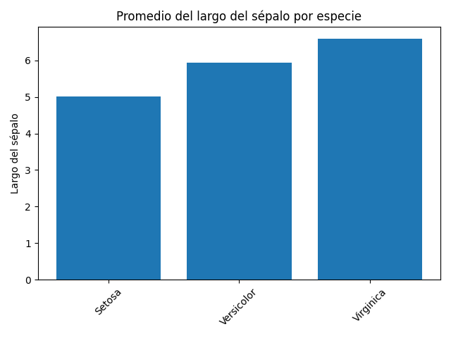
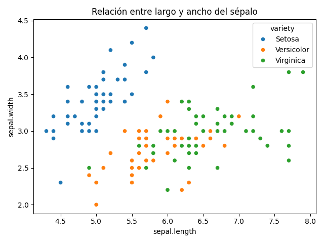

## Resumen general  

En este análisis trabajé con el dataset Iris, que contiene información sobre distintas flores.  

El objetivo fue observar cómo cambian las medidas de los pétalos y los sépalos dependiendo de la especie, y ver si se pueden diferenciar fácilmente.
En total hay **150 registros**.

---

## Estadísticas generales

|      |   sepal.length |   sepal.width |   petal.length |   petal.width |
|:-----|---------------:|--------------:|---------------:|--------------:|
| mean |           5.84 |          3.06 |           3.76 |           1.2 |
| min  |           4.3  |          2    |           1    |           0.1 |
| max  |           7.9  |          4.4  |           6.9  |           2.5 |

Esta tabla muestra un resumen general de las medidas del dataset, permitiendo ver los valores promedio, mínimos y máximos.

---

## Resumen por especie

| variety    |   Sepal Length (Mean) |   Sepal Length (Min) |   Sepal Length (Max) |   Sepal Width (Mean) |   Sepal Width (Min) |   Sepal Width (Max) |   Petal Length (Mean) |   Petal Length (Min) |   Petal Length (Max) |   Petal Width (Mean) |   Petal Width (Min) |   Petal Width (Max) |
|:-----------|----------------------:|---------------------:|---------------------:|---------------------:|--------------------:|--------------------:|----------------------:|---------------------:|---------------------:|---------------------:|--------------------:|--------------------:|
| Setosa     |                  5.01 |                  4.3 |                  5.8 |                 3.43 |                 2.3 |                 4.4 |                  1.46 |                  1   |                  1.9 |                 0.25 |                 0.1 |                 0.6 |
| Versicolor |                  5.94 |                  4.9 |                  7   |                 2.77 |                 2   |                 3.4 |                  4.26 |                  3   |                  5.1 |                 1.33 |                 1   |                 1.8 |
| Virginica  |                  6.59 |                  4.9 |                  7.9 |                 2.97 |                 2.2 |                 3.8 |                  5.55 |                  4.5 |                  6.9 |                 2.03 |                 1.4 |                 2.5 |

Esta tabla permite comparar las características de cada especie, mostrando cómo cambian las medidas de pétalos y sépalos.

---

##  Hallazgos importantes  

Después de observar la tabla se puede notar varias diferencias entre las especies.

- La especie con mayor tamaño promedio de pétalo es **Virginica**  
- La especie con menor tamaño promedio de pétalo es **Setosa**  
- La especie con mayor variabilidad en pétalos es **Virginica**  
- La especie con mayor tamaño de sépalo es **Virginica**   

En general, el tamaño del pétalo es una de las variables que más ayuda a diferenciar las especies.  
También se puede notar que algunas especies son muy fáciles de distinguir, mientras que otras son más parecidas entre sí.

---

## Información de las especies  

### Setosa  
Es la más pequeña y fácil de identificar.

### Versicolor  
Tiene tamaño intermedio y puede confundirse más.

### Virginica  
Es la más grande y destaca por sus pétalos largos.

### Promedio de longitud de pétalos  

Este gráfico muestra el promedio de la longitud de los pétalos para cada especie de flor.

---

### Promedio del largo del sépalo  

Aquí se puede ver que el tamaño del sépalo también cambia dependiendo de la especie.

---

### Relación entre largo y ancho del sépalo  

En este gráfico se observa la relación entre el largo y el ancho del sépalo. Los puntos están coloreados por especie, lo que permite ver cómo se agrupan las flores.

## Conclusión
Después de analizar los datos, pude notar que sí hay diferencias claras entre las especies del dataset Iris.

La especie **Setosa** es la que tiene los pétalos más pequeños, por lo que se hace más fácil de identificar.  
Por otro lado, **Virginica** es la que tiene los pétalos más grandes.  
La otra especie queda como en un punto intermedio, ya que no es ni tan pequeña ni tan grande como las demás.
